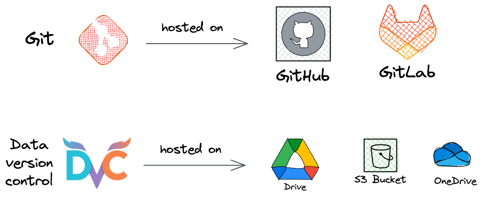

# Data Version Control (DVC)

Managing data efficiently is crucial when working on large-scale data projects.  
**Data Version Control (DVC)** brings Git-like capabilities to datasets and models, making collaboration, tracking, and reproducibility much easier.

> 📢 **You cannot build large, reliable data projects until you master Data Version Control!**

<br>

## Benefits of Data Version Control

- 🔎 **Track Changes**: Know exactly who made what changes and when, across datasets and models.
- 🛠️ **Easier Debugging**: Diagnose and fix issues that arise during deployment or production by tracking data changes.
- 🤝 **Effective Collaboration**: Team members can seamlessly share and work on datasets without manual synchronization.
- 🔁 **Conflict Resolution**: Review changes, merge updates, and resolve conflicts just like you would with code.

<br>

## Motivation for Using DVC

- 📜 **Reproducibility**: Ensure that datasets used for training are consistent across different environments.
- 🔍 **Traceability**: Track every change made to datasets and models, providing a clear audit trail.
- 🌐 **Collaboration and Data Sharing**: Teams can work on large datasets collaboratively without duplicating efforts.
- 🛡️ **Data Governance and Compliance**: Keep a detailed record of data changes for auditing and regulatory compliance.
- ⏪ **Easy Rollbacks**: Quickly revert to previous versions of datasets if needed.

<br>

## Why Not Just Use GitHub for Data?

- GitHub (or Git) is **designed for lightweight code and text files**, not for managing large datasets or binary files.
- Git struggles with large file sizes and cannot handle frequent large binary file changes efficiently.
- DVC complements Git by handling large data separately while keeping track of it within Git.

<br>

## Ideal Requirements from a Data Version Control System

- ✅ Ability to **track all data changes** similarly to how Git tracks file changes.
- ✅ Support for **both structured (CSV, Parquet)** and **unstructured (images, audio, video)** data.
- ✅ Capability for **branching**, **merging**, and **committing** data versions.
- ✅ **Git-like commands** and syntax for a familiar experience.
- ✅ Full **compatibility with Git**, enabling integration into existing workflows.
- ✅ Built-in support for **collaboration**, enabling teams to work efficiently.

<br>

## How DVC Works

- **Git** stores the codebase in remote repositories like GitHub or GitLab.
- **DVC** manages data and models by storing them in **separate remote storage systems** (like Google Drive, S3, Azure Blob, etc.).
- Git only tracks the lightweight **metadata** created by DVC, while the actual data remains in the remote storage.

> 🖼️ Visual Representation:
> 

<br>

# Getting Started: Versioning Data with DVC

Follow these steps to set up DVC in your project:


## 1. Install DVC
```bash
pip install dvc
```


## 2. Set Up Your Project
```bash
mkdir data
git init
dvc init
```
- Initializes both Git and DVC in your project.


## 3. Track Data with DVC
```bash
dvc add data/data.csv
```
- `dvc add` generates a `.dvc` file that Git can track without storing the heavy data directly.


## 4. Commit Changes to Git
```bash
git add .
git commit -m "Initialize DVC and track dataset"
```


## 5. Configure Remote Storage (e.g., Google Drive)
```bash
dvc remote add myremote gdrive://1_7J2bLGdfrRqyVdeup5Yn7wUkGywdm
git add .dvc/config
git commit -m "Configure DVC remote storage"
```
- Here, `gdrive://...` is the Google Drive URL. You can also configure S3, Azure, SSH, etc., as remotes.


## 6. Push Data and Metadata
```bash
dvc push -r myremote
git push origin main
```
- `dvc push` uploads your actual dataset to remote storage.
- `git push` syncs your code and metadata to the Git repository.


## 7. Pull Data from Remote

When another team member (or you on another machine) clones the Git repository:

```bash
git clone https://github.com/your-repo/project.git
cd project
dvc pull -r myremote
```
- `dvc pull` downloads the actual data files from the remote storage, based on the `.dvc` metadata files.

**Important:** `git clone` will only bring code and metadata; `dvc pull` is needed to bring real data!

<br>

# Other Useful DVC Commands

| Command | Purpose |
| :------ | :------ |
| `dvc status` | Check if data or models are out of sync with the remote. |
| `dvc diff` | Compare different versions of your datasets or models. |
| `dvc repro` | Reproduce the entire pipeline when changes are made (for pipelines). |
| `dvc gc` | Garbage collect unused data from cache and remote. |

<br>

# Best Practices with DVC

- 🧹 **Use `.dvcignore`**: To avoid accidentally tracking unnecessary files (similar to `.gitignore`).
- 🌳 **Branch your data**: Create different branches for different experiments.
- 📂 **Organize Data Clearly**: Store raw, processed, and intermediate data separately.
- 🔒 **Secure your remote storage**: Especially if you’re using cloud buckets or drives.
- ⚡ **Automate Pull & Push**: Using CI/CD pipelines to automate `dvc pull` and `dvc push` when deploying models.
- 📑 **Document your remote setup**: Keep a README or config file updated with remote storage details.

<br>

# Conclusion

DVC empowers data science and ML teams to build **scalable**, **reproducible**, and **collaborative** workflows by treating datasets and models with the same discipline as code.

If you want to work on real-world, production-grade data projects — mastering DVC is a must!
